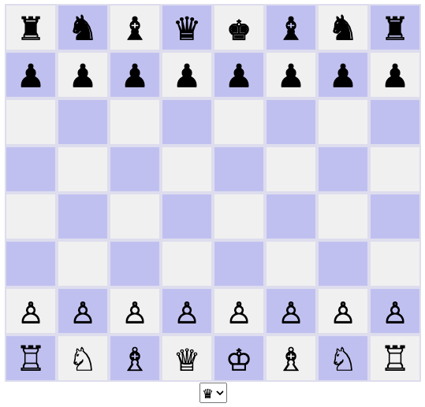

# nanochess-asae

Example of a static website that can be published on Azure Spring Apps Enterprise.

## Deploy to Azure Spring Apps Enterprise

* Create an application placeholder for your static web application, e.g.
```
az spring app create --name nanochess --assign-endpoint true --cpu 1 --memory 1
```

* Deploy the static web application to your Azure Spring Apps (Enterprise) instance, e.g. with either `nginx` or `httpd`
```
az spring app deploy --name nanochess --source-path . --build-env BP_WEB_SERVER=nginx
az spring app deploy --name nanochess --source-path . --build-env BP_WEB_SERVER=httpd
```

* Observe the output and test the application



## Documentation

More details on how to [Deploy web static files to Azure Spring Apps Enterprise](https://learn.microsoft.com/en-us/azure/spring-apps/how-to-enterprise-deploy-static-file).

## Nanochess Credits

The javascript version of nanochess is from [Toledo's Javascript Chess Game](https://nanochess.org/chess4.html)
